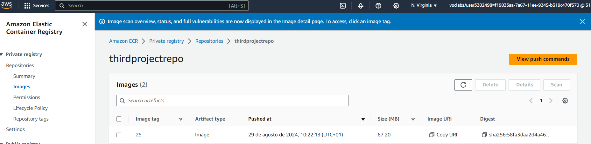
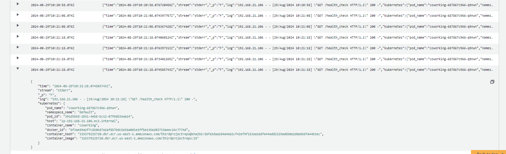

### AWS Services used

This project uses Python, PostgreSQL, Docker and Kubernetes to create an app that keeps track of users in a coworking space. The following AWS services are used to operationalize the microservice:

- Elastic Kubernetes Service (EKS) to manage the Kubernetes cluster:
        
- EC2 to provide computing resources such as the node groups present in the EKS cluster I have previously created:
        
- Elastic Container Registry (ECR) to create a repository where the image outlined in my [Dockerfile](./Dockerfile) will be hosted:
        
        
- Codebuild to set up continuous integration (CI) to push and update the Docker image when merge requests are pushed to Github. Githooks have been used to update the build:
        
- CloudWatch Logging to get information about important events in our application and container insights:
        
        

### Configuration files, Docker and Kubernetes

In the root folder, we find a [Dockerfile](./analytics/Dockerfile) with the instructions to build the image that will containerise the coworking microservice. Inside the analytics folder, one can see a [buildspec.yml](./analytics/buildspec.yml) that outlines the steps for the CI pipeline that will be followed by CodeBuild. 

On the other hand, in the deployment, we find two configuration files: [postgresql-deployment.yaml](./deployment/postgresql-deployment.yaml) and [postgresql-service.yaml](./deployment/postgresql-service.yaml). These files contain key information about the container (its ports, username, database name...) and the port where the service will run respectively. In the deployment folder we can also see [pv.yaml](./db/pv.yaml) and [pvc.yaml](./db/pvc.yaml), which are resources that manage storage inside of the Kubernetes cluster.

Moreover, in the deployment folder, there is a [ConfigMap.yml](./deployment/ConfigMap.yml) that stores key info about the database and a [secrets.yaml](./deployment/secrets.yml) file separately. [deployment.yaml](./deployment/deployment.yaml) includes Kubernetes configs about deployment and service, stating that the Kubernetes cluster is of type LoadBalancer.

Note: please see my <b>screenshots folder</b> for remaining screenshots to fulfill all requirements in the project, with a particular focus on the screenshots with the results of kubectl commands (get pods, get services, get deployment, describe pods, describe services, describe deployments).