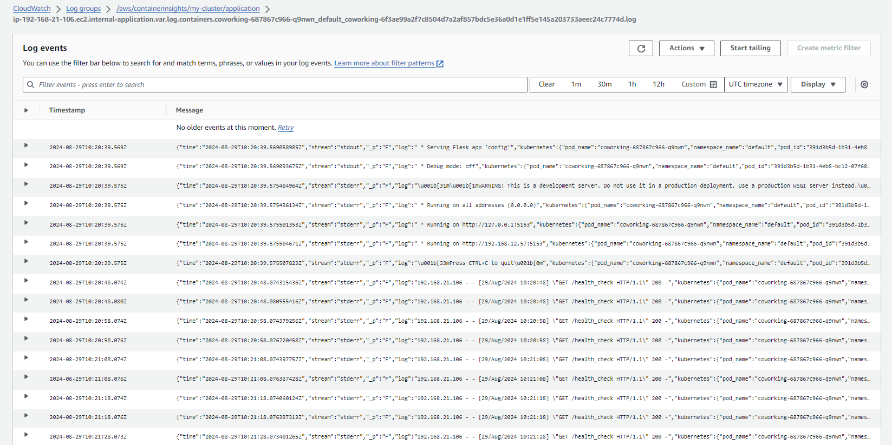

### AWS Services used

This project uses Python, PostgreSQL, Docker and Kubernetes to create an app that keeps track of users in a coworking space. The following AWS services are used to operationalize the microservice:

- Elastic Kubernetes Service (EKS) to manage the Kubernetes cluster:
        
- EC2 to provide computing resources such as the node groups present in the EKS cluster I have previously created:
        
- Elastic Container Registry (ECR) to create a repository where the image outlined in my [Dockerfile](./analytics/Dockerfile) will be hosted:
        
        
- Codebuild to set up continuous integration (CI) to push the Docker image when merge requests are pushed to Github:
        
- CloudWatch Logging to get information about important events in our application and container insights:
        

### Configuration files, Docker and Kubernetes

Inside of the analytics folder, we find a [Dockerfile](./analytics/Dockerfile) with the instructions to build the image that will containerise the coworking microservice. We can also see a [buildspec.yml](./analytics/buildspec.yml) that outlines the steps for the CI pipeline that will be followed by CodeBuild. 

On the other hand, in the db folder, we can find two configuration files: [postgresql-deployment.yaml](./db/postgresql-deployment.yaml) and [postgresql-service.yaml](./db/postgresql-service.yaml). These files contain key information about the container (its ports, username, database name...) and the port where the service will run respectively. In the db folder we can also see [pv.yaml](./db/pv.yaml) and [pvc.yaml](./db/pvc.yaml), which are resources that manage storage inside of the Kubernetes cluster.

Finally, inside of the deployment folder, there is a [configmap.yaml](./deployment/configmap.yaml) that stores key info about the database and a [secrets.yaml](./deployment/secrets.yaml) file separately. [coworking.yaml](./deployment/coworking.yaml) includes Kubernetes configs about deployment and service, stating that the Kubernetes cluster is of type LoadBalancer.

Note: please see my screenshot folder for remaining screenshots to fulfill all requirements in the project.